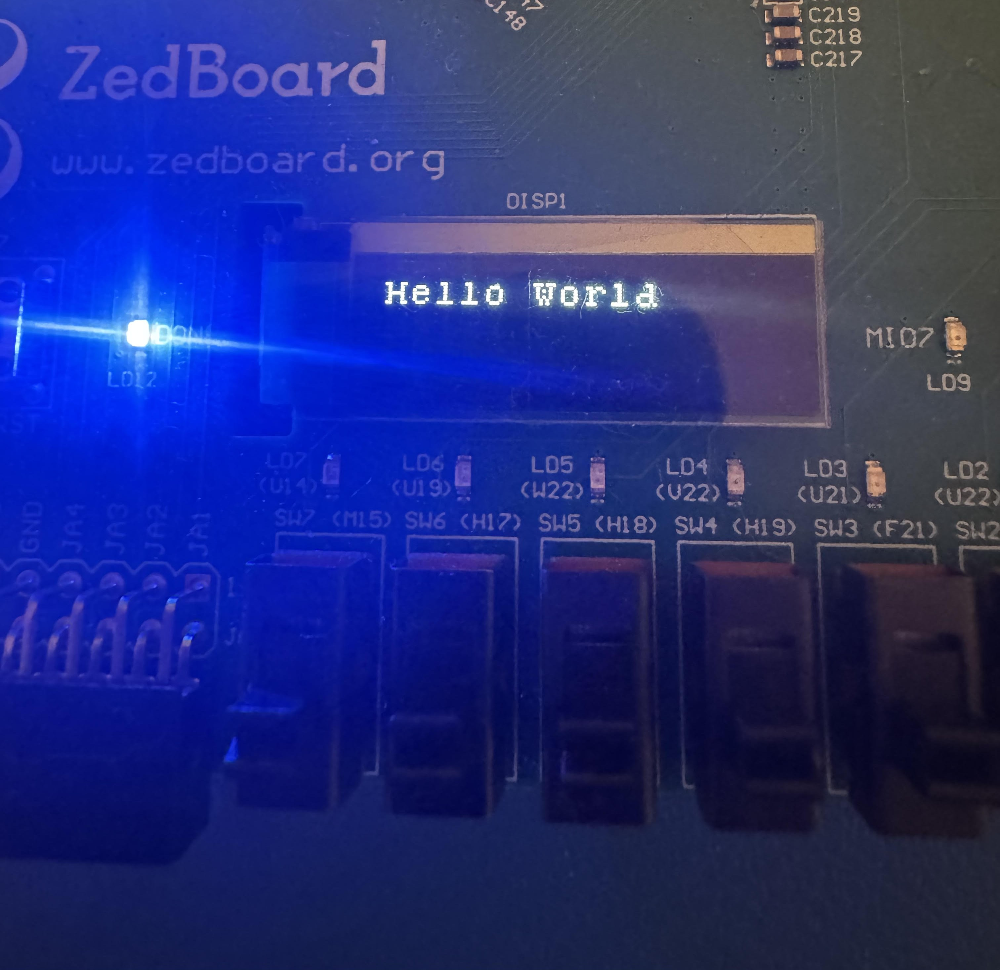

# ZedBoard OLED Display — Full Series Notes

> **Original tutorial series by:** Vipin Kizheppatt  
> **Tutorial tool versions:** Vivado 2017.4 / Xilinx SDK  
> **These notes use:** Vivado 2025.2.1 / Vitis 2025.2

These notes document how to follow the ZedBoard OLED tutorial series on modern tooling, covering every difference, debug issue, and fix encountered along the way. The goal of the final project is to drive the ZedBoard's on-board OLED display from software running on the Zynq PS, using a custom AXI-Lite IP core built in the Vivado PL.

---



## Table of Contents

| # | Video | Notes File | Status |
|---|-------|------------|--------|
| 1 | [SPI Controller](https://www.youtube.com/watch?v=V8jW81VaLOg&list=PLXHMvqUANAFOviU0J8HSp0E91lLJInzX1&index=8) | [docs/01_spi_controller.md](docs/01_spi_controller.md) | ✅ Complete |
| 2 | [ILA Debugging on Vivado](https://www.youtube.com/watch?v=kTjeTOf6ACI&list=PLXHMvqUANAFOviU0J8HSp0E91lLJInzX1&index=9) | [docs/02_ila_debugging.md](docs/02_ila_debugging.md) | ✅ Complete |
| 3 | [OLED Part 1](https://www.youtube.com/watch?v=GILjTGScbfc&list=PLXHMvqUANAFOviU0J8HSp0E91lLJInzX1&index=10) | [docs/03_oled_parts_1_2_3.md](docs/03_oled_parts_1_2_3.md) | ✅ Complete |
| 4 | [OLED Part 2](https://www.youtube.com/watch?v=iQs3wfZRmxk&list=PLXHMvqUANAFOviU0J8HSp0E91lLJInzX1&index=11) | [docs/03_oled_parts_1_2_3.md](docs/03_oled_parts_1_2_3.md) | ✅ Complete |
| 5 | [OLED Part 3](https://www.youtube.com/watch?v=dNjxdfCOP58&list=PLXHMvqUANAFOviU0J8HSp0E91lLJInzX1&index=12) | [docs/03_oled_parts_1_2_3.md](docs/03_oled_parts_1_2_3.md) | ✅ Complete |
| 6 | [Hardware Software Codesign 1](https://www.youtube.com/watch?v=pEilWi6PMHY&list=PLXHMvqUANAFOviU0J8HSp0E91lLJInzX1&index=13) | [docs/04_hw_sw_codesign.md](docs/04_hw_sw_codesign.md) | ✅ Complete |
| 7 | [Generating Custom User IP Core in Vivado](https://www.youtube.com/watch?v=I0eu_Y3pMmM&list=PLXHMvqUANAFOviU0J8HSp0E91lLJInzX1&index=14) | [docs/04_hw_sw_codesign.md](docs/04_hw_sw_codesign.md) | ✅ Complete |
| 8 | [Drivers for Custom IP](https://www.youtube.com/watch?v=U-75MjbZyJE&list=PLXHMvqUANAFOviU0J8HSp0E91lLJInzX1&index=15) | [docs/04_hw_sw_codesign.md](docs/04_hw_sw_codesign.md) | ✅ Complete |
| 9 | [OLED Part 4](https://www.youtube.com/watch?v=c0w33XQDC6M&list=PLXHMvqUANAFOviU0J8HSp0E91lLJInzX1&index=16) | [docs/05_oled_part4_axi_software.md](docs/05_oled_part4_axi_software.md) | ✅ Complete |

**Additional reference docs:**
- [docs/bugs_and_fixes.md](docs/bugs_and_fixes.md) — Root cause analysis for every bug hit across the series
- [docs/vivado_2025_differences.md](docs/vivado_2025_differences.md) — Focused reference for all Vivado 2025 divergences from the tutorial
- [docs/vitis_troubleshooting.md](docs/vitis_troubleshooting.md) — Quick-reference for Vitis errors, hangs, and debug techniques
---

## Other Resources

| Resource | Link |
|----------|------|
| OLED User Guide | [UG-2832HSWEG04.pdf](https://cdn-shop.adafruit.com/datasheets/UG-2832HSWEG04.pdf) |
| SSD1306 Command Reference | [SSD1306.pdf](https://cdn-shop.adafruit.com/datasheets/SSD1306.pdf) |
| Tutorial Author's GitHub | [ZynqOLED](https://github.com/vipinkmenon/ZynqOLED) |
| charROM ASCII bitmap source | [charROM.v](https://github.com/vipinkmenon/ZynqOLED/blob/master/src/charROM.v) |

---

## Repository Structure

```
/
├── README.md
├── docs/
│   ├── 01_spi_controller.md
│   ├── 02_ila_debugging.md
│   ├── 03_oled_parts_1_2_3.md
│   ├── 04_hw_sw_codesign.md
│   ├── 05_oled_part4_axi_software.md
│   ├── bugs_and_fixes.md
│   ├── vivado_2025_differences.md
│   └── images/                  ← screenshots and photos referenced in notes
├── ip_repo/
│   └── oledControlp4/
│       └── oledControlp4_2_0/
│           ├── hdl/
│           │   └── oledControlp4_slave_lite_v2_0_S00_AXI.v
│           │   └── oledControlp4.v
│           └── src/
│               ├── top.v
│               ├── oledControl.v
│               ├── spiController.v
│               ├── delayGen.v
│               └── charROM.v
└── sw/
    ├── oled.h
    ├── oled.c
    └── main.c
```

---

## Recommended File Structure for Each Video's Project

```
Project Folder/
├── vivado/    ← Vivado project goes here
└── ws/        ← Vitis workspace goes here
```

---

## Final Project Architecture

```
Zynq PS (ARM Cortex-A9)
    │
    │  AXI-Lite (memory-mapped registers)
    ▼
oledControlp4 (Custom AXI-Lite IP — Vivado PL)
    │
    │  slv_reg0 [+0x0] — Control  (PS writes, HW clears on sendDone)
    │  slv_reg1 [+0x4] — Status   (HW sets on sendDone, PS clears)
    │  slv_reg2 [+0x8] — Data     (PS writes ASCII character byte)
    │  slv_reg3 [+0xC] — Reserved
    │
    ▼
oledControl.v (Hardware FSM)
    │  Runs full SSD1306 init sequence automatically on power-up
    │  Accepts one ASCII character at a time via sendData/sendDataValid
    │  Looks up 8×8 pixel bitmap from charROM
    │  Sends 8 SPI bytes per character via spiController
    ▼
spiController.v (SPI shift register — max 10 MHz)
    │
    ▼
ZedBoard On-Board OLED (128×32 pixels, SSD1306 controller)
```

---

## Key Tips — Quick Reference

> The most important lessons from the full series. Read these before starting.

1. **Save a working copy at each stage.** If a later video breaks something, you have a stable checkpoint to return to rather than rebuilding from scratch.

2. **Use `<=` (non-blocking) exclusively inside clocked `always` blocks.** A single `=` (blocking) assignment inside a state machine can silently desynchronize signal timing, causing completely unexpected hardware behavior with no compile error to guide you.

3. **Custom IP drivers in Vitis 2025.x:** The tutorial attaches driver `.h`/`.c` files to the IP package via the IP Packager's TCL driver mechanism — this is still the correct long-term approach, and you should still add your driver files to the IP package. However, in Vitis 2025.x the TCL-based driver loading does not work correctly and breaks bitstream generation. As a **temporary workaround**, copy the driver source files directly into `src/` in your Vitis application alongside `main.c`. The proper fix for 2025.x likely involves a different driver integration method, but that solution is not yet documented here.

4. **Always set Board Initialization to FSBL** before running applications that use custom IP. The default TCL initialization mode does not work with custom IP and throws: `invalid command name 'ps7_init'`.

5. **When you have many synthesis/implementation warnings**, paste them into an AI assistant to triage — most are harmless metadata warnings, but some (like `TIMING-17` unconstrained clocks) are worth understanding before moving on.

6. **The ZedBoard OLED is 32×128 pixels**, not 64×128 as implied by some SSD1306 documentation. Use the correct display dimensions when setting up page addressing.

7. **In custom AXI-Lite register blocks**, always match addresses using `(S_AXI_AWVALID ? S_AXI_AWADDR : axi_awaddr)` — not `axi_awaddr` alone. See `docs/bugs_and_fixes.md` Bug #5 for why this single omission caused the hardest bug in the entire series.
