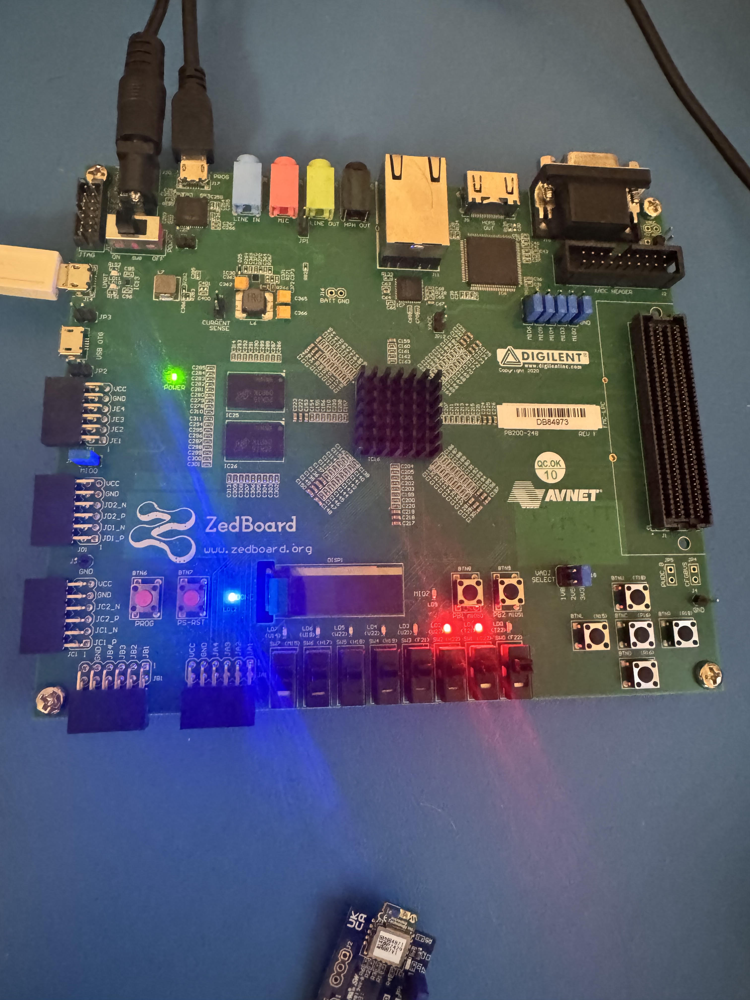

# Video 2 — ILA Debugging on Vivado

**Video:** [ILA Debugging on Vivado](https://www.youtube.com/watch?v=kTjeTOf6ACI&list=PLXHMvqUANAFOviU0J8HSp0E91lLJInzX1&index=9)  
**Vivado 2025 differences:** Minor — noted below.

---

## Overview

This video introduces the Integrated Logic Analyzer (ILA) — a debug core that is synthesized directly into the FPGA fabric alongside your design. It lets you observe internal signals on real hardware in real time, without needing a physical logic analyzer.

---

## Key Concepts

**ILA (Integrated Logic Analyzer):**
- Implemented inside the FPGA using LUT and flip-flop resources — be mindful of resource usage on large designs.
- Triggered by a configurable condition on any probed signal.
- Viewed in Vivado Hardware Manager after programming the device.
- Essential for debugging issues that only appear on real hardware, not in simulation.

---

## Vivado 2025 Difference

In Vivado 2025, the ILA debug constraints are placed in a **separate `.xdc` debug file** (e.g., `debug.xdc`) rather than inside the main source file as the tutorial shows. This is the recommended approach and works cleanly — just be aware the file structure looks slightly different from what the tutorial demonstrates.

After adding ILA probes, **re-run synthesis before generating the bitstream** if Vivado shows synthesis as out-of-date. This ensures the debug netlist is included in the build.

---

## Workflow

1. Mark signals for debug in your Verilog source using the `mark_debug` attribute:
   ```verilog
   (* mark_debug = "true" *) reg [7:0] mySignal;
   ```
   Or mark nets in the elaborated design via **Tools → Set Up Debug**.
2. Run synthesis.
3. In the **Set Up Debug** wizard, assign probed nets to an ILA core and set sample depth.
4. Run implementation and generate bitstream.
5. Program the device via **Vivado Hardware Manager → Program Device**.
6. In Hardware Manager, find the ILA core, set trigger conditions, and arm the trigger.
7. Run your design and capture the waveform.

---

## Observations From Testing

On first ILA test with the SPI controller:
- One LED was on at start.
- After pressing the top push button, the second LED came on as well — confirming the hardware was responding correctly to inputs.

**When adding nets to the ILA in the Set Up Debug wizard:**  
`DataCount` was optimized by Vivado into one-hot encoding — its waveform is not easily human-readable. Skip it or decode it manually if needed; it is not a useful signal to watch directly.

---

## Captured Waveforms

**Data In = `0xFF`:**


**ZedBoard hardware configuration for the above capture:**



**Switches set to `01010101`:**


