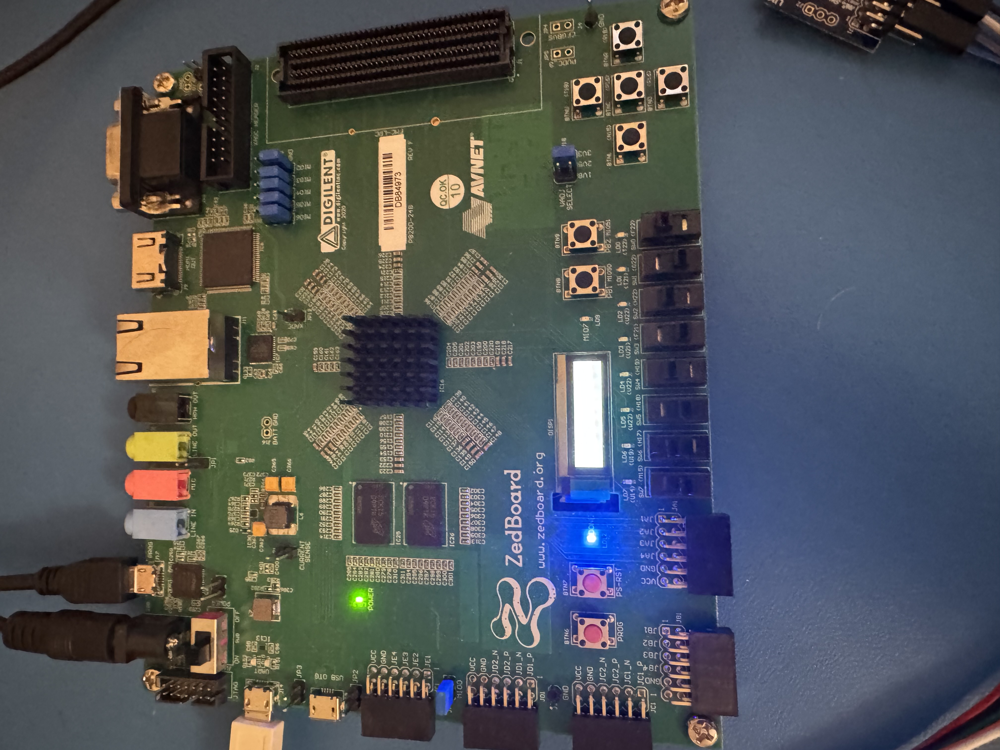
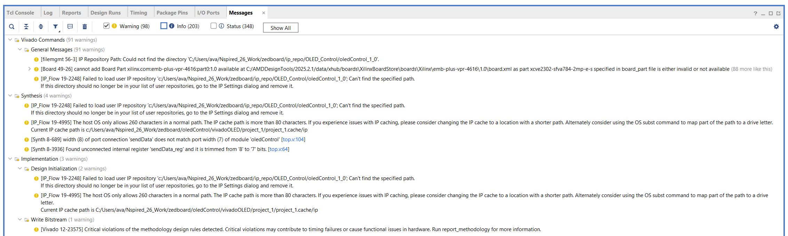
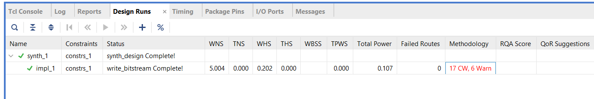
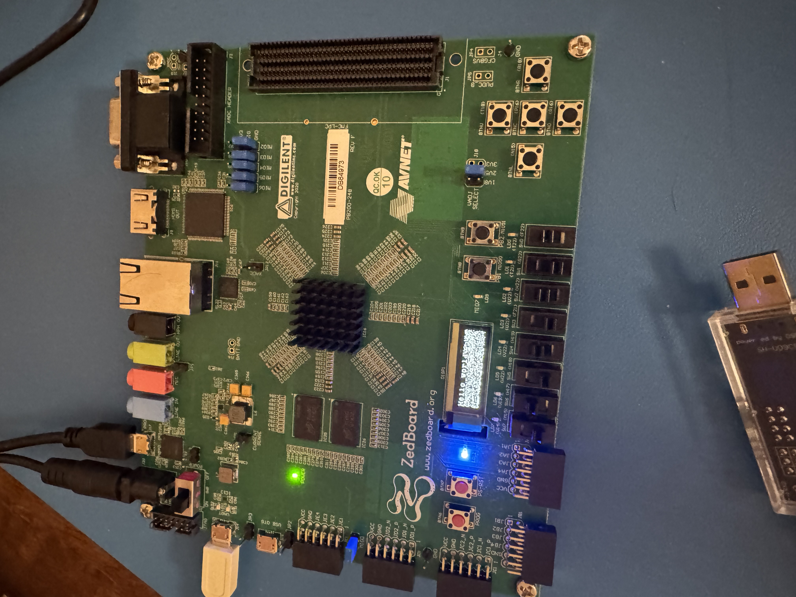

# Videos 3–5 — OLED Parts 1, 2, and 3

**Videos:**
- [OLED Part 1](https://www.youtube.com/watch?v=GILjTGScbfc&list=PLXHMvqUANAFOviU0J8HSp0E91lLJInzX1&index=10)
- [OLED Part 2](https://www.youtube.com/watch?v=iQs3wfZRmxk&list=PLXHMvqUANAFOviU0J8HSp0E91lLJInzX1&index=11)
- [OLED Part 3](https://www.youtube.com/watch?v=dNjxdfCOP58&list=PLXHMvqUANAFOviU0J8HSp0E91lLJInzX1&index=12)

**Vivado 2025 differences:** None for Parts 1 and 2. Minor differences in Part 3 — noted below.

**Project path (Part 3):**
```
zedboard/oledControl/vivadoOLED/project_1/project_1.xpr
```

---

## Overview

These three videos build the complete hardware-only OLED display system in Verilog:
- **Part 1:** OLED initialization sequence (power-up commands via SPI)
- **Part 2:** Sending data bytes to the display (handshake protocol)
- **Part 3:** Full character rendering — a string is hardcoded in the PL and displayed on the OLED

The result at the end of Part 3 is a working ZedBoard that displays `Hello World` on the OLED using purely hardware logic, no software or PS involvement.

---

## OLED Hardware Facts

> Read these before starting — they prevent wasted debugging time.

- The ZedBoard OLED is **32×128 pixels** — not 64×128 as some SSD1306 documentation implies. Use the correct dimensions when calculating page addresses.
- The SSD1306 command reference PDF describes a 64×128 display. The ZedBoard variant has half the height. Page addressing and row count must be adjusted accordingly.
- Download and keep the **OLED User Guide** ([UG-2832HSWEG04.pdf](https://cdn-shop.adafruit.com/datasheets/UG-2832HSWEG04.pdf)) open while following the video — cross-reference each command the tutorial sends against the datasheet to build familiarity with the document.
- **Page Address Mode** is used in this design (not Horizontal or Vertical mode).
- SPI sends 1 byte at a time. Each character is an **8×8 pixel bitmap = 8 bytes**. Sending one character requires 8 SPI transfers.

---

## OLED Part 1 — No Differences

Follow the tutorial as-is.

**Download both PDFs before starting and keep them open as references:**
- [OLED User Guide (display hardware)](https://cdn-shop.adafruit.com/datasheets/UG-2832HSWEG04.pdf) — physical display specs, pin descriptions, electrical characteristics
- [SSD1306 Command Reference](https://cdn-shop.adafruit.com/datasheets/SSD1306.pdf) — the actual SPI commands sent during initialization and display control

As the tutorial describes each SPI command, look it up in the SSD1306 command reference to build familiarity with the document. You will reference it throughout Parts 1–3.

---

## OLED Part 2 — No Differences

### Handshake Protocol (Producer/Consumer)

The inter-module handshake used in this design follows a producer/consumer pattern:

- **Consumer** (the OLED display — it needs data) is represented by the calling module raising `sendDataValid` to signal that data is ready and waiting to be sent.
- **Producer** (`oledControl` FSM — it produces the SPI output) sees `sendDataValid` high, performs the SPI transfer, then raises `sendDone` to acknowledge that the byte was delivered.
- The consumer side sees `sendDone` high, lowers `sendDataValid`, and the cycle repeats for the next byte.

In plain terms: the consumer signals demand (`sendDataValid`), the producer fulfills it and confirms (`sendDone`).

**Important Verilog timing note:** When a module sets a signal high, the receiving module does not see the change until the **next clock cycle**. Design your handshake conditions and state transitions with this one-cycle lag in mind.

### Part 2 Correction (from the video itself)

The tutorial author realized during Part 2 that an additional 2ms delay was needed in the initialization sequence. This is already incorporated into the final `oledControl.v` source — no action required, just noting it for awareness.


**Expected result — all OLED pixels on:**  
When the middle push button (P16) is held, the OLED dims and goes black. When released, the display fully illuminates again. This confirms the initialization sequence is working.



---

## OLED Part 3 — Differences and Debug

### Source: `charROM.v`

The tutorial references a character ROM for ASCII bitmap lookup. Use the tutorial author's own version from his GitHub repo:

[charROM.v — ZynqOLED GitHub](https://github.com/vipinkmenon/ZynqOLED/blob/master/src/charROM.v)

This file contains the 7-bit ASCII character set encoded as 8×8 binary bitmaps. Use this directly in your project.

### Debug: Set the Top Module Correctly

Before running synthesis or generating a bitstream, confirm that **`top.v` is set as the top module** in Vivado.

- Right-click `top.v` in the Sources panel → **Set as Top**.
- If the top module is not set correctly, Vivado expects physical pin assignments for every port of whatever module it considers top — which will cause errors in synthesis and bitstream generation for ports that don't have XDC constraints.

### Critical: `oledControl.v` Requires Fixes Beyond the Tutorial

The `oledControl.v` built in this video series requires three fixes that are **not shown in the tutorial**. Without them, the OLED works correctly in a standalone project but **fails to initialize once combined with any other component** (such as a Pmod TMP2 temperature sensor over IIC). In a multi-component project the OLED will power on but the initialization sequence never completes — the display stays blank or shows garbage. See `bugs_and_fixes.md` Bugs #6, #7, and #8 for full detail.

The changes are in the main `always @(posedge clock)` block:

```verilog
always @(posedge clock)
begin
    if(reset)
    begin
        state        <= IDLE;
        nextState    <= IDLE;
        oled_vdd     <= 1'b1;
        oled_vbat    <= 1'b1;
        oled_reset_n <= 1'b1;
        oled_dc_n    <= 1'b1;
        startDelay   <= 1'b0;
        spiData      <= 8'b0;
        spiLoadData  <= 1'b0;
        currPage     <= 0;
        sendDone     <= 0;
        columnAddr   <= 0;
        byteCounter  <= 4'd0;    // added to reset block
    end
    else
    begin
        // added: default assignments so synthesis keeps these signals
        startDelay  <= 1'b0;
        spiLoadData <= 1'b0;
        case(state)
            ...
        endcase
    end
end
```

If your `oledControl.v` has `(* KEEP = "TRUE" *)` attributes on registers, that is a symptom of incomplete signal assignments — remove them after applying the fixes above.

### Debug: Use `<=` Everywhere in State Machines

Every register assignment inside a clocked `always` block must use `<=` (non-blocking). Using `=` (blocking) even once in a state machine can prevent the OLED from turning on at all.

```verilog
// CORRECT — always use non-blocking in clocked always blocks
state <= NEXT_STATE;
oled_vdd <= 1'b0;

// WRONG — blocking assignment in a clocked block
state = NEXT_STATE;   // do not do this
```

In Part 3 testing, a single `=` in the state machine prevented the OLED from powering on entirely. Changing it to `<=` fixed the issue immediately.

### Warnings

Synthesis and implementation will produce several warnings. This is normal for a ZedBoard project:

- **ZedBoard is not a default Vivado board** — generates a board-related warning. Harmless.
- **Long path names on Windows** — can be an issue if Windows long path support is not enabled. Enable long paths in Windows settings if you see path-related errors.
- When in doubt about any warning, paste it into an AI assistant for a quick triage — most are harmless metadata noise.





### Expected Result

After correct synthesis, implementation, bitstream generation, and programming the ZedBoard:



`Hello World` is displayed on the OLED driven entirely by hardware logic — no PS or software involved.

---

## Part 3 Notes — Concepts

**Why 8 SPI transfers per character:**  
Each character in the charROM is stored as a 64-bit value (8 bytes × 8 bits). Each byte represents one column of pixels in the character's 8×8 grid. The FSM sends these 8 bytes one at a time through the SPI controller, filling 8 columns on the display per character.

**Page Address Mode:**  
The SSD1306 groups display rows into "pages" (each page is 8 rows tall). The ZedBoard's 32-row display has 4 pages (rows 0–7, 8–15, 16–23, 24–31). The `0x22` command sets the active page range before writing character data.
