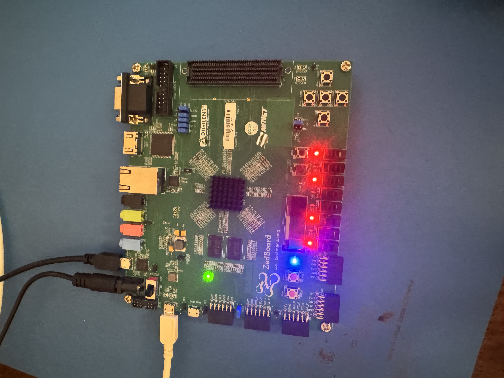

# Videos 6–8 — Hardware/Software Codesign, Custom IP, and Drivers

**Videos:**
- [Hardware Software Codesign 1](https://www.youtube.com/watch?v=pEilWi6PMHY&list=PLXHMvqUANAFOviU0J8HSp0E91lLJInzX1&index=13)
- [Generating Custom User IP Core in Vivado](https://www.youtube.com/watch?v=I0eu_Y3pMmM&list=PLXHMvqUANAFOviU0J8HSp0E91lLJInzX1&index=14)
- [Drivers for Custom IP](https://www.youtube.com/watch?v=U-75MjbZyJE&list=PLXHMvqUANAFOviU0J8HSp0E91lLJInzX1&index=15)

These three videos form a bridge between the pure-hardware OLED work (Parts 1–3) and the final software-driven OLED (Part 4). They introduce the Zynq PS, AXI interconnect, Vitis, and custom IP packaging using a simpler GPIO example before applying those concepts to the OLED.

---

## Video 6 — Hardware Software Codesign 1

### Overview

Introduces the Zynq PS (Processing System) and how it communicates with PL (Programmable Logic) over the AXI bus using a standard GPIO IP core. Software running on the ARM core reads switch positions and drives LEDs through an AXI GPIO IP block.

### Key Concepts

**IP (Intellectual Property):** A reusable hardware module, pre-designed and packaged for use in Vivado block designs. Xilinx ships many standard IPs (GPIO, UART, Timer, etc.); you can also create your own custom IP.

**AXI (Advanced eXtensible Interface):** The standard bus protocol connecting the Zynq PS to PL logic. The PS is the AXI master; custom IP blocks and Xilinx IPs are AXI slaves. All communication happens through memory-mapped registers at specific base addresses.

```
AXI-Lite register addressing example (GPIO IP):
  Base address + 0x0  → reg0 → LEDs
  Base address + 0x4  → reg1 → Switches
```

**Register size:** Each AXI register is **4 bytes (32 bits)**. Offsets between consecutive registers are always `+4`.

### Vivado 2025 Differences

**Block design auto-connection looks different from the tutorial.** The Vivado 2025 Connection Automation result has a different visual layout than the tutorial's 2017 version. The underlying connections are functionally equivalent — accept the auto-connection result and proceed.


**Xilinx SDK is replaced by Vitis.** The tutorial uses Xilinx SDK, which is no longer supported. Use Vitis 2025.2 instead.

### Vitis Project Setup (Replaces SDK)

In Vitis 2025.2, the workflow differs from SDK:

1. **Create Platform** — connect to the exported `.xsa` file from Vivado (File → Export → Export Hardware, include bitstream).
2. **Build Platform** — required before creating an application. The platform contains the BSP (Board Support Package) and hardware-specific libraries.
3. **Create Empty Application** — link it to the platform you just built.
4. **Add `main.c`** to the `src/` folder of the application.
5. Build and run.

> A platform must exist and be built before an application can reference it, because the application links against platform-generated headers (like `xparameters.h`) that only exist after the platform build.


**Example code — write `0xA5` to LED register:**

```c
#include "xparameters.h"
#include <xil_io.h>

int main(){
    Xil_Out8(XPAR_AXI_GPIO_0_BASEADDR, 0xA5);  // Write pattern to LED register
}
```

> The base address macro `XPAR_AXI_GPIO_0_BASEADDR` is auto-generated by Vitis from your `.xsa` file and defined in `xparameters.h`. Use this macro rather than hardcoding the raw address — it stays correct if the address ever changes in the block design.

**Result:** LEDs light up in the `0xA5` (`10100101`) bit pattern.



---

## Video 7 — Generating Custom User IP Core in Vivado

### Overview

Creates a custom AXI-Lite IP in Vivado that replicates the GPIO functionality from the previous video, but using hand-written Verilog instead of Xilinx's pre-built GPIO IP. This teaches the structure of a custom AXI slave and how software addresses its registers.

### Custom IP Concepts

**Master vs. Slave:** When creating a custom IP for the ZedBoard that communicates with the Zynq PS, the IP is an AXI **slave** and the PS is the **master**. The PS initiates all reads and writes; the IP responds.

**Register interface:** The PS communicates with the IP exclusively through memory-mapped registers. The IP's registers are the only interface the software sees — all hardware behavior must be controlled and observed through register reads and writes.

**Register addressing (GPIO example):**
```
Base address + 0x0  → reg0 → LEDs (write)
Base address + 0x4  → reg1 → Switches (read)
```

Find the base address in Vivado: **Block Design → Address Editor tab.**


### Vivado 2025 Differences

**After opening the IP project, the screen layout differs from the tutorial.** This is a UI change between versions. The underlying functionality is the same.


**Block design appearance differs.** The 2025 auto-connection layout looks different from 2017. Functionally equivalent.


**Pin assignment:** Connect LED and switch pins in the **IO Ports** tab of the Synthesized Design. Use the [ZedBoard Hardware User Guide](https://reference.digilentinc.com/reference/programmable-logic/zedboard/reference-manual) to find the correct package pin numbers.

### Running the Application — Critical: FSBL Board Initialization

> **This step is required for any application using custom IP.**

Before running the application in Vitis:

1. Click the gear icon (Run/Debug Configurations) or right-click the application → Run As → Run Configurations.
2. Find **Board Initialization**.
3. Change it from the default to **FSBL**.

Without this change, Vitis uses TCL initialization, which does not work with custom IP and throws:

```
Vitis error: "invalid command name 'ps7_init'"
```

After changing to FSBL, run the application and the LEDs should light up in the `0xA5` pattern.

### Post-Video Code Improvement

After verifying the basic LED write, update `main.c` to read switches and mirror them to LEDs in real time:


---

## Video 8 — Drivers for Custom IP

### Overview

Adds a software driver layer (`.h`/`.c` files) on top of the raw register-access code, abstracting the hardware details from `main.c`. This is the same pattern used in the OLED Part 4 software driver.

### What a Driver Is

A driver is an abstraction layer between hardware registers and application code:

- `.h` file: declares the IP's struct (holds base address) and function prototypes
- `.c` file: implements driver functions that hide raw `Xil_Out32`/`Xil_In32` calls behind readable function names. Common driver functions include:
  - `initIP()` — store the base address in the driver struct; set up any initial register state
  - `writeIP()` — write a value to a specific register offset
  - `readIP()` — read a value back from a specific register offset
  - Additional functions as needed (e.g., `resetIP()`, `isReadyIP()`, `setModeIP()`)
- Application code only calls driver functions; it never touches raw addresses directly


**Example `main.c` using driver:**

```c
#include "gpioControl.h"

int main(){
    gpioControl myGpio;
    initGpio(&myGpio, XPAR_GPIO_CONTROL_0_BASEADDR);

    while (1) {
        writeGpio(&myGpio, readGpio(&myGpio));  // mirror switches to LEDs
    }

    return 0;
}
```

### Vivado 2025 Critical Difference — Driver Files

> **This is the most important difference in this video for Vitis 2025.x users.**

The tutorial shows attaching driver `.h`/`.c` files to the IP package via the IP Packager's TCL-based driver mechanism. **You should still add your driver files to the IP package** — this is the correct long-term approach and what the tutorial intends.

However, in Vitis 2025.x the TCL-based driver loading does not work correctly:
- `main.c` cannot find the driver headers when attached via TCL.
- Attempting to fix it by editing the `.tcl` file causes bitstream generation to fail.

**Temporary workaround for Vitis 2025.x:**
1. Build the platform first (generates BSP and any IP-packaged driver stubs).
2. Locate the driver `.h` and `.c` files — from the IP's `drivers/` folder in the IP repo, or from the generated platform BSP.
3. **Copy them directly into the `src/` folder** of your Vitis application, alongside `main.c`.
4. The compiler finds them as local source files. No TCL involvement required.

> The proper fix for Vitis 2025.x likely involves a different driver integration method that does not rely on the TCL packager. That solution is not yet documented here — this workaround is a known gap.
